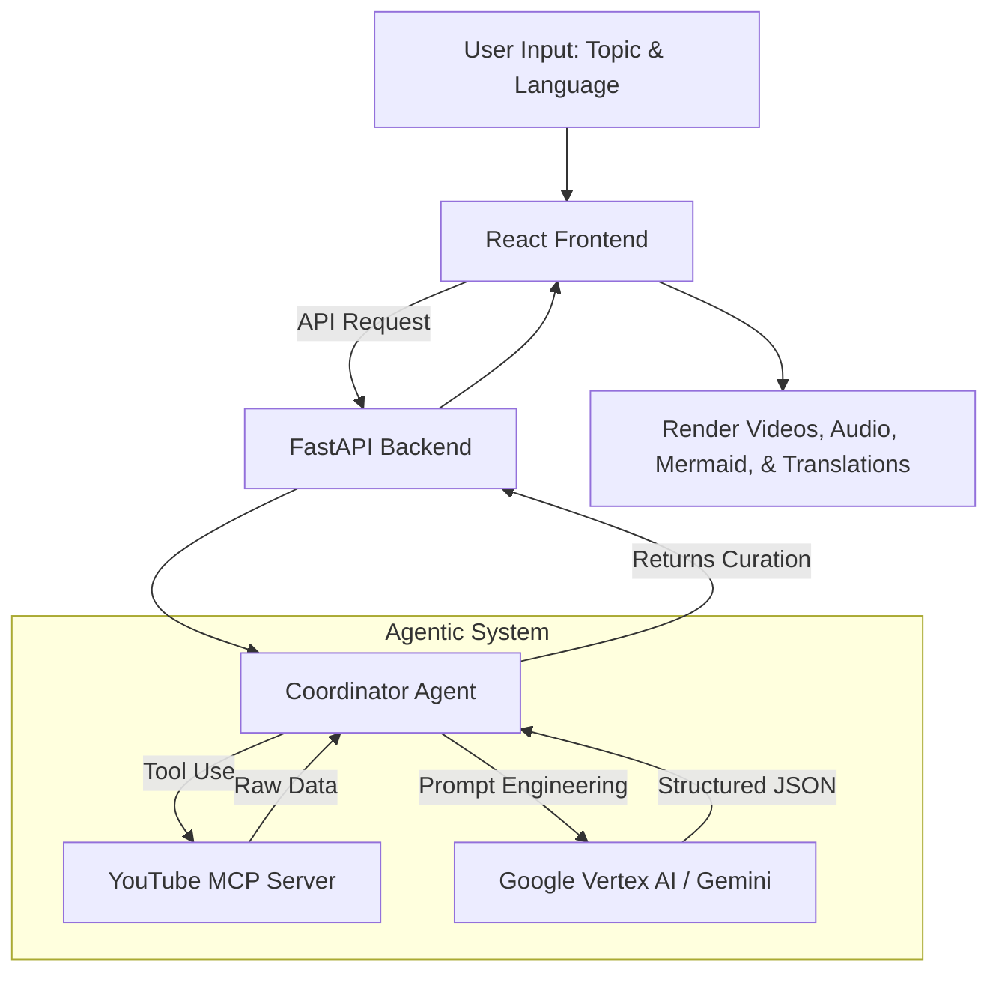

# AuraLearn. The Agentic Learning Platform 🌌

> **Break the barrier of knowledge.**  
> Learn complex topics through curated videos, summarized and translated instantly by our AI Agents.

  

AuraLearn is a next-generation educational platform that uses a sophisticated Multi-Agent System to dynamically curate, summarize, and translate educational content. Instead of endlessly scrolling through search results, AuraLearn acts as your personal AI tutor, providing tailored learning paths from beginner to expert.

---

## 🚀 Live Demo
**[Experience AuraLearn Live on Google Cloud Run](https://auralearn-frontend-1085673018125.us-central1.run.app)**

---

## 💡 The Problem & Our Solution
**The Problem:** The internet is filled with incredible educational content, but it suffers from information overload and language barriers. Students waste hours trying to find videos suited for their specific skill level, and non-English speakers often miss out on top-tier global knowledge.

**The Solution:** AuraLearn utilizes Agentic AI to autonomously scour the web using Model Context Protocol (MCP) servers to find the absolute best YouTube videos for Beginner, Intermediate, and Expert levels. It then summarizes the core concepts, translates them into the user's native language, generates visual structural diagrams, and creates interactive quizzes to test knowledge.

---

## ✨ Ultimate Features
- 🧠 **Agentic Curation**: Dynamically fetches the best YouTube videos tailored to distinct learning levels (Beginner, Intermediate, Advanced, and full Playlists).
- 🌍 **Instant Localization**: Translates both the UI and the highly-detailed AI summaries into 14+ international and regional languages.
- 🎙️ **Audio Summaries**: Generates engaging, podcast-style audio scripts that you can listen to directly in the app.
- 📊 **Structural Diagrams**: Automatically generates and renders full-screen Mermaid.js mind maps and diagrams to visualize complex topics.
- 🎓 **Authentic Certifications**: AI agent actively searches for and recommends 3 highly authentic, free online certifications/courses related to your topic.
- 📝 **Gemini Gems Integration**: 1-click prompt generation to instantly test your knowledge via Google Gemini based on the specific video you just watched.
- 📓 **NotebookLM Export**: Seamlessly export your curated learning path to Google NotebookLM to generate custom podcasts, study guides, and quizzes.

---

## 🏗️ Architecture & System Flow



---

## 🛠️ Tech Stack & Key Concepts Demonstrated (Kaggle Evaluation)

This project heavily demonstrates the key concepts required for the hackathon:

| Concept | Implementation Details |
|---------|------------------------|
| **Agent / Multi-agent system** | The core backend is powered by a Coordinator Agent utilizing the **Google GenAI SDK** and **Vertex AI**. The agent makes autonomous decisions, structures complex outputs into rigid JSON schemas, and handles fallback logic if rate-limited. |
| **MCP Server** | The agent natively binds a custom **Model Context Protocol (MCP) Server** (`search_youtube`). It autonomously decides when and how to use this tool to fetch beginner, intermediate, and advanced video IDs. |
| **Antigravity** | The entire application—from initial boilerplate to complex CSS animations, Dockerization, and Cloud deployment—was built via **Vibe-coding** utilizing the Antigravity IDE assistant. |
| **Security Features** | Strict separation of concerns. The frontend contains zero sensitive data. The backend manages the YouTube Data API keys and Vertex AI credentials securely via Environment Variables (`.env`) and Google Cloud Secret Manager / IAM Service Accounts. |
| **Deployability** | The project is fully containerized with highly optimized `Dockerfile`s for both frontend and backend. It is deployed automatically to **Google Cloud Run** with Nginx acting as a reverse proxy for the Vite frontend. |

---

## 💻 Local Setup & Installation

### Prerequisites
- Node.js (v18+)
- Python (3.10+)
- Google Cloud CLI (`gcloud`) authenticated.
- YouTube Data API Key

### Backend Setup
```bash
cd backend
python -m venv venv
source venv/bin/activate  # On Windows use `venv\Scripts\activate`
pip install -r requirements.txt

# Create a .env file and add your YouTube API Key
echo 'YOUTUBE_API_KEY="your_api_key_here"' > .env

# Run the backend
uvicorn main:app --reload --port 8000
```

### Frontend Setup
```bash
cd frontend
npm install

# Run the frontend
npm run dev
```

---

## 👨‍💻 Author
**Paaras Shemrudkar**  
*Aspiring Agentic AI Engineer*
